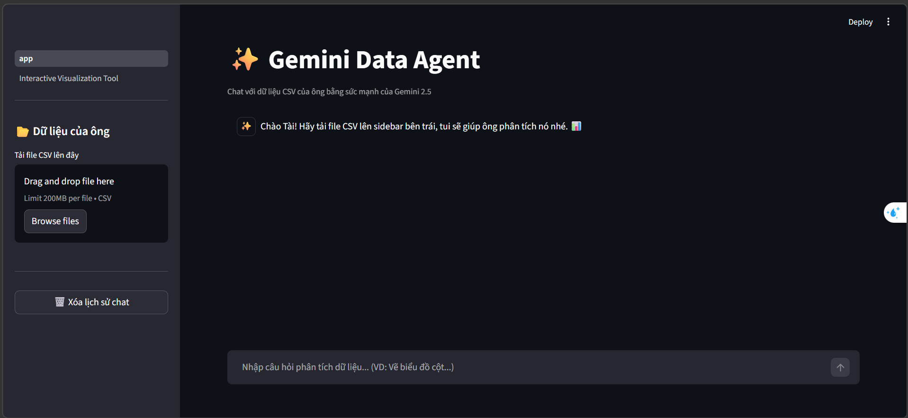
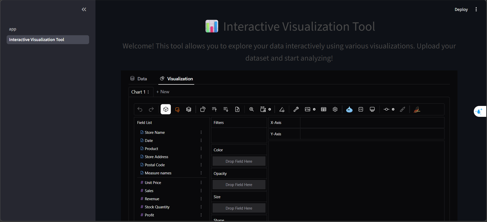

Dagemini là một công cụ phân tích dữ liệu ứng dụng Mô hình Ngôn ngữ Lớn (LLM) Gemini của Google, giúp hỗ trợ các tác vụ xử lý và phân tích dữ liệu thông qua giao diện trò chuyện tự nhiên. Dự án này sử dụng Streamlit để xây dựng một ứng dụng web tương tác, nơi người dùng có thể tải dữ liệu lên, đặt câu hỏi, khám phá dữ liệu trực quan và nhận được các phân tích chuyên sâu từ AI ngay lập tức.

##  Tính năng nổi bật

- **Tải lên tệp CSV**: Dễ dàng tải dữ liệu CSV của bạn thông qua thanh bên (sidebar).
- **Phân tích Dữ liệu**: Đặt câu hỏi về dữ liệu và nhận câu trả lời được xử lý bởi Google Gemini (Gemini 2.5 Flash/Pro).
- **Trực quan hóa Dữ liệu**: Tự động tạo và hiển thị các biểu đồ dựa trên câu hỏi của bạn.
- **Công cụ Trực quan hóa Tương tác**: Khám phá dữ liệu trực quan với thao tác kéo thả dễ dàng để tạo các biểu đồ tùy chỉnh, được hỗ trợ bởi thư viện Pygwalker.
- **Lưu trữ Lịch sử Trò chuyện**: Chuyển đổi mượt mà giữa các tab mà không bị mất lịch sử chat hay dữ liệu đã tải lên.

## Giao diện Ứng dụng

### Trò chuyện với Dữ liệu (Chat)

*Chào mừng! Tải lên tệp CSV, nhập câu hỏi và để tác tử Gemini lo phần còn lại.*

### Công cụ Trực quan hóa Tương tác

*Công cụ này cho phép bạn khám phá dữ liệu một cách trực quan bằng nhiều loại biểu đồ khác nhau. Hãy tải dữ liệu lên và bắt đầu phân tích!*

### Video Demo

##  Hướng dẫn Cài đặt & Sử dụng

### Yêu cầu hệ thống

- Python 3.9 trở lên
- pip (Trình quản lý gói Python)
- API Key của Google Gemini (Lấy tại [Google AI Studio](https://aistudio.google.com/))

### Các bước Cài đặt

1. Clone kho lưu trữ (repository) này về máy: 
 ```
git clone https://github.com/taiiswibu/DaGemini
cd dagemini

```

2. Tạo môi trường ảo (virtual environment):
```
python -m venv .venv
source .venv/bin/activate   # Trên Windows sử dụng lệnh: `.venv\Scripts\activate`

```


3. Cài đặt các thư viện cần thiết:
```
pip install -r requirements.txt

```


4. Thiết lập biến môi trường:
Tạo một tệp `.env` ở thư mục gốc của dự án và thêm API key của Google vào.
```env
# API keys
GOOGLE_API_KEY=your_gemini_api_key_here

# Cấu hình đường dẫn Python
PYTHONPATH=.

```


### Chạy Ứng dụng

Để khởi động ứng dụng Streamlit, hãy chạy lệnh sau trong terminal:

```bash
streamlit run app.py

```

Ứng dụng web sẽ tự động mở lên trong trình duyệt mặc định của bạn.

### Cách Sử dụng

1. Tải lên một tệp CSV chứa dữ liệu của bạn từ thanh bên.
2. Sử dụng khung chat để hỏi các câu hỏi về dữ liệu (VD: "Tóm tắt tập dữ liệu này", "Vẽ biểu đồ cột thể hiện Doanh số theo Khu vực").
3. Chuyển sang trang **Interactive Visualization Tool** để tự do khám phá dữ liệu bằng giao diện kéo thả.

## Cấu trúc Dự án

```text
├── README.md
├── app.py
├── scr
│   ├── agents
│   │   ├── base.py
│   │   └── pandas_agent.py
│   ├── models
│   │   └── llms.py
│   ├── prompts
│   │   └── prompts.py
│   ├── tools
│   │   └── tools.py
│   └── utils
│       └── utils.py
├── data
│   └── sample_data.csv
├── notebooks
├── pages
│   └── 2_Interactive Visualization Tool.py
├── requirements.txt
├── images
│   ├── chat_with_data.png
│   └── interactive_visualization_tool.png
└── videos
    ├── demo_video_01.mp4
    └── demo_video.gif

```

### Chi tiết các thành phần

* `app.py`: Script chính để chạy ứng dụng web Streamlit và giao diện Chat.
* `scr/agents`: Chứa các lớp Tác tử (Agent) chịu trách nhiệm xử lý truy vấn của người dùng.
* `base.py`: Lớp cơ sở (Base class) cho các tác tử.
* `pandas_agent.py`: Tác tử được thiết kế riêng để thao tác với pandas DataFrames, sử dụng các công cụ từ LangChain.


* `scr/models`: Khởi tạo Mô hình Ngôn ngữ.
* `llms.py`: Lớp để tương tác với các mô hình Google Gemini (Gemini 2.5).


* `scr/prompts`: Chứa các mẫu câu lệnh (prompt templates) cho tác tử.
* `prompts.py`: Các mẫu prompt được tối ưu hóa cho khả năng suy luận của Gemini.


* `scr/tools`: Các công cụ tiện ích để thao tác dữ liệu và tương tác với mô hình.
* `tools.py`: Công cụ Python REPL tùy chỉnh để thực thi mã do AI tạo ra.


* `scr/utils`: Các hàm tiện ích chung.
* `utils.py`: Chức năng ghi log (logging) và các tiện ích khác.


* `data`: Thư mục lưu trữ các tệp dữ liệu mẫu.
* `sample_data.csv`: Tệp CSV mẫu để thử nghiệm.


* `pages`: Thư mục chứa các trang phụ của Streamlit.
* `2_Interactive Visualization Tool.py`: Script cho công cụ trực quan hóa tương tác Pygwalker.


## Docs

* [LangChain](https://github.com/langchain-ai/langchain)
* [Streamlit](https://www.streamlit.io/)
* [Pygwalker](https://github.com/Kanaries/pygwalker)
* [Google Gemini API](https://ai.google.dev/)

